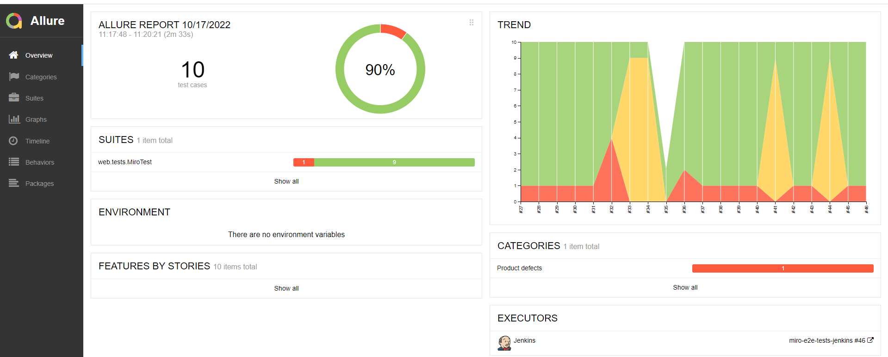
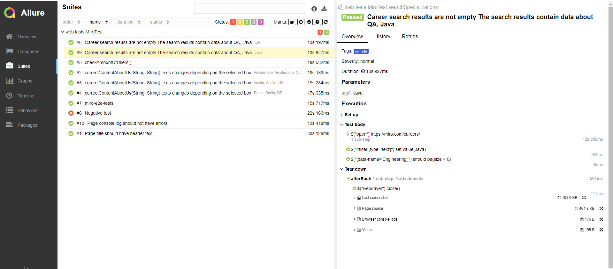
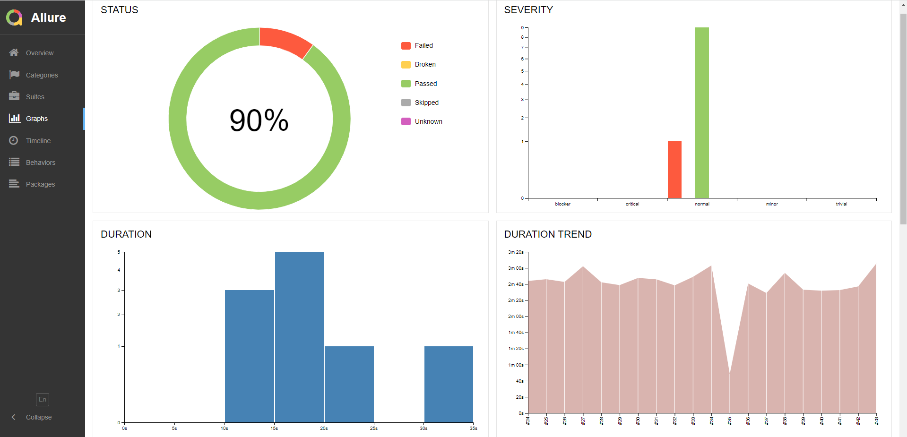
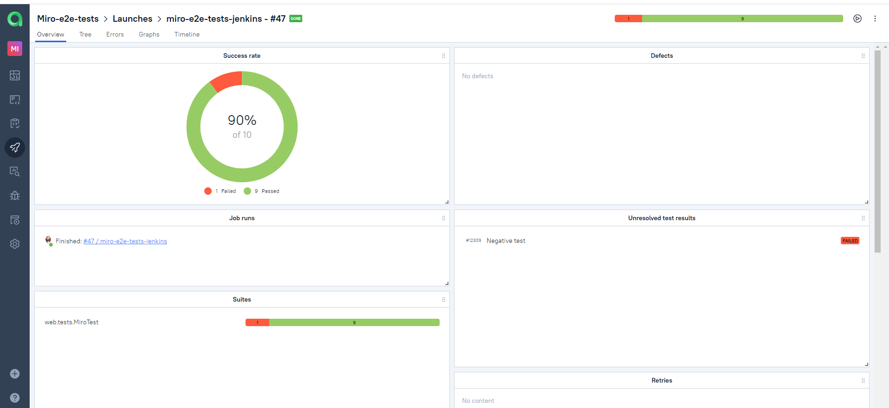
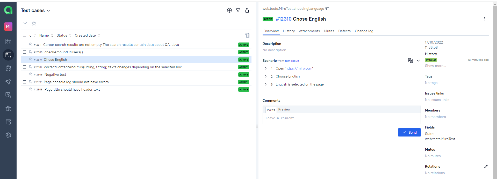
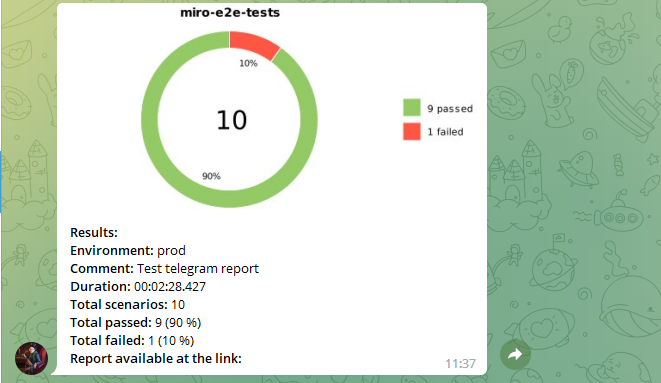
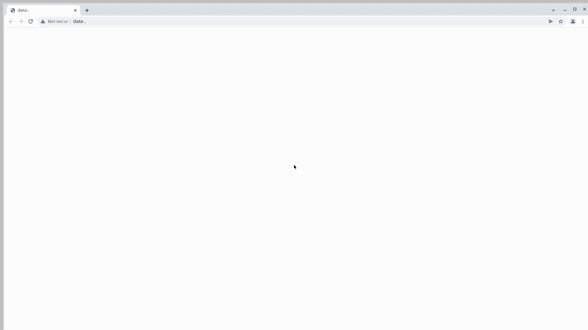
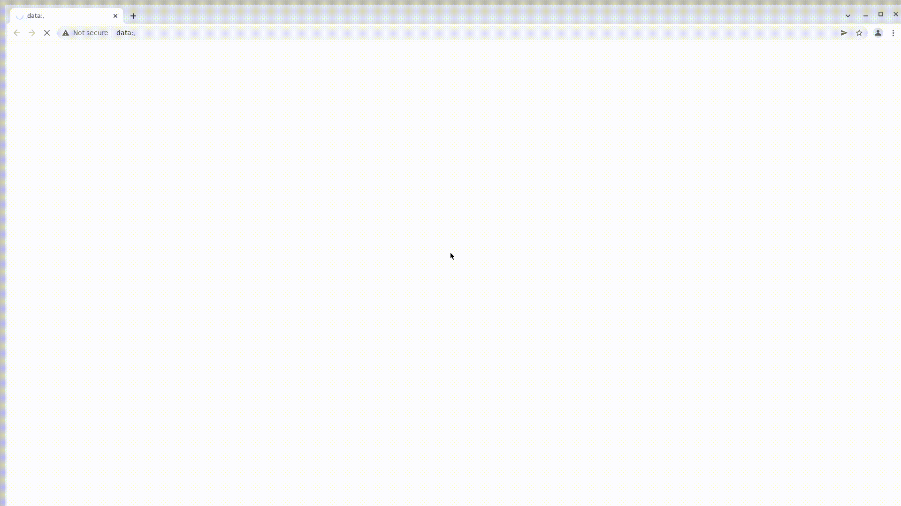

# Проект по автоматизации тестирования для Miro
<a target="_blank" href="https://miro.com/">The Visual Collaboration Platform for Every Team | Miro</a> 
<p align="center">
<a href="https://miro.com/"></a>

</p>

## :scroll: Содержание:

- [Технологии и инструменты](#rocket-технологии-и-инструменты)
- [Реализованные проверки](#scroll-реализованные-проверки)
- [Сборка в Jenkins](#-jenkins-job)
- [Запуск тестов из терминала](#earth_africa-Запуск-тестов-из-терминала)
- [Allure отчет](#-отчет-в-allure-report)
- [Интеграция с Allure TestOps](#earth_africa-Интеграция-с-Allure-TestOps)
- [Отчет в Telegram](#-уведомление-в-telegram-при-помощи-бота)
- [Видео примеры прохождения тестов](#-примеры-видео-о-прохождении-тестов)

## :rocket: Технологии и инструменты

<p align="center">
<a href="https://www.jetbrains.com/idea/"></a>
<a href="https://www.java.com/"></a>
<a href="https://github.com/"></a>
<a href="https://junit.org/junit5/"></a>
<a href="https://gradle.org/"></a>
<a href="https://selenide.org/"></a>
<a href="https://aerokube.com/selenoid/"></a>
<a href="https://github.com/allure-framework/allure2"></a>
<a href="https://www.jenkins.io/"></a>
</p>

## :scroll: Реализованные-проверки

- :heavy_check_mark: Проверка смены языка.
- :heavy_check_mark: Проверка наличия вакансий по запросу QA и Java.
- :heavy_check_mark: Проверка отображения вакансий выбранного города при клике на иконку столицы.
- :heavy_check_mark: Проверка наличия логотипа при смене языка.
- :heavy_check_mark: Проверка, что страница меняет свое названия при смене языка.
- :x: Пример упавшего теста.

## </a> Jenkins job
<a target="_blank" href="https://jenkins.autotests.cloud/job/miro-e2e-tests-jenkins/">Сборка в Jenkins</a>
<p align="center">
<a href="https://jenkins.autotests.cloud/job/miro-e2e-tests-jenkins/"></a>
</p>

### Параметры сборки в Jenkins:

* BrowserName (браузер, по умолчанию chrome)
* BrowserVrersion (версия браузера, по умолчанию 91.0)
* BrowserSise (размер окна браузера, по умолчанию 1920x1080)
* BrowserMobile (название мобильного устройства, для примера iPhone X)
* remoteDriverUrl (логин, пароль и адрес удаленного сервера selenoid или grid)
* videoStorage (адрес, по которому можно получить видео)

### :computer: Запуск тестов из терминала

```bash
gradle clean test
```

### :robot: Удаленный запуск:

```bash
clean
test
-DremoteUrl=https://${LOGIN}:${PASSWORD}@${REMOTE_DRIVER_URL}/wd/hub
-Dbrowser_name=${BROWSER_NAME}
-Dbrowser_version=${BROWSER_VERSION}
-Dbrowser_size=${BROWSER_SIZE}
-DbrowserMobileView="${BROWSER_MOBILE}"
-DvideoStorage=https://${REMOTE_DRIVER_URL}/video/
```

## </a> Отчет в <a target="_blank" href="https://jenkins.autotests.cloud/job/miro-e2e-tests-jenkins/45/allure/">Allure report</a>

### Основное окно

<p align="center">

</p>

### Тесты

<p align="center">

</p>

### Гафики

<p align="center">

</p>

## </a>Интеграция с <a target="_blank" href="https://allure.autotests.cloud/launch/16057">Allure TestOps</a>

### Дашборд

<p align="center">

</p>

### Тест-кейсы

<p align="center">

</p>


## </a> Уведомление в Telegram при помощи бота

<p align="center">

</p>

### </a> Примеры видео о прохождении тестов

<p align="center">
  
</p>